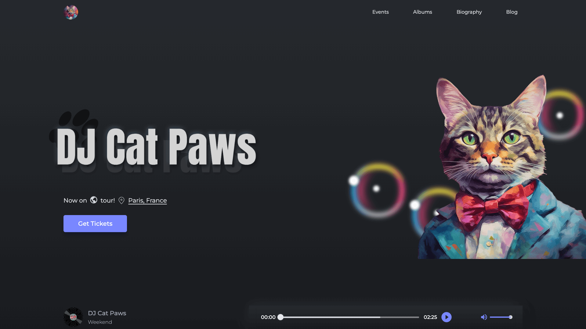
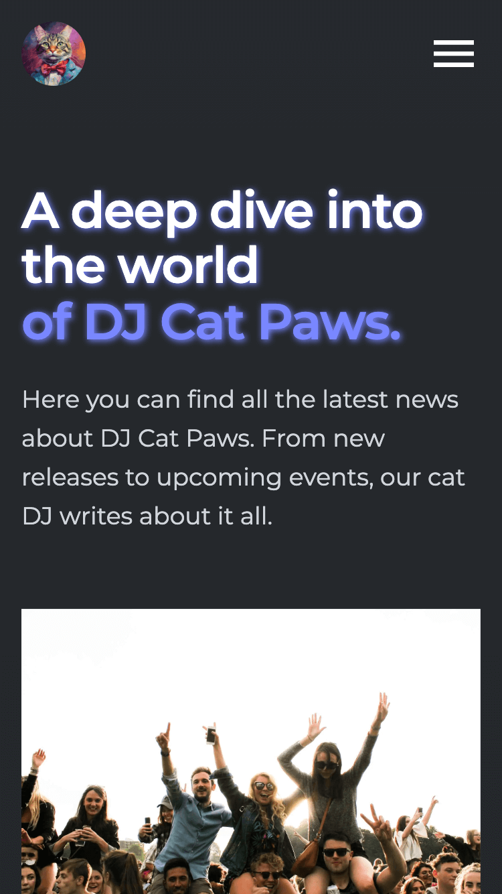
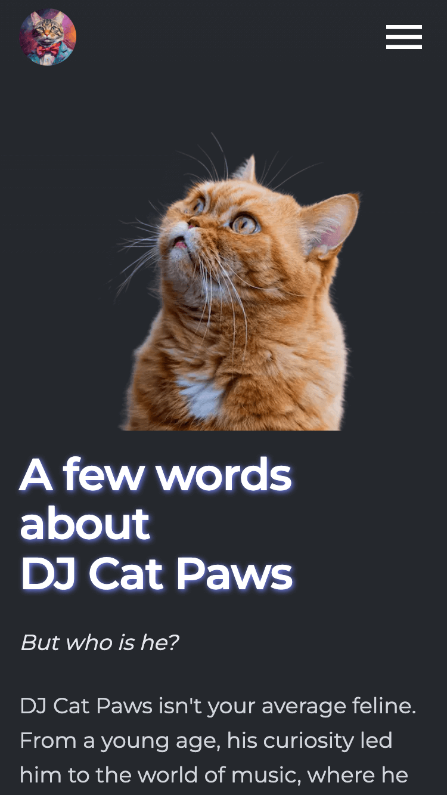

# Tunes Showcase

<div style="display: flex flex-direction: column">
&nbsp;&nbsp;
&nbsp;&nbsp;
<div style="display: flex; gap:20px">


</div>
</div>
<br>
<br>

A Next 13, fully responsive portfolio for a cat DJ, named DJ Cat Paws. Built to be different and creative, it features creative design, a music player, animations, and much more!

Although it is a showcase project, it is built with scalability in mind. Featuring Sanity for content management, along with a custom desk setup, it features a fully functional blog, pricing section and the ability to expand it further.

This project was a lovely opportunity to experiment further not only with Sanity, but also with building a creative UI with quite a few animations.

Regarding the tooling, React Server Components, TypeScript, Framer Motion, Tailwind, and ShadCn are used among others. For a detailed overview, please have a look at the [**Features**](#features) & [**Tech**](#tech) section.

<br>

## Installation

As this project was created with `create-next-app`, the following commands are available:

**Install** the dependencies:

```
npm install
```

Run the app in **development** mode:

```
npm run dev
```

<br>

## <a id='features'></a>Features

-   ISR
-   GROQ webhook for on-demand revalidation
-   Content Management (Sanity)
-   Custom desk setup and icons
-   Background & scroll animations
-   A dynamic blog section

<br>

## <a id='tech'></a>Tech

-   NextJS 13
-   TypeScript
-   Sanity
-   ShadCn
-   Framer Motion
-   Tailwind
-   React Icons

<br>

For a more detailed overview of the development & production dependencies, please check `package.json`.
